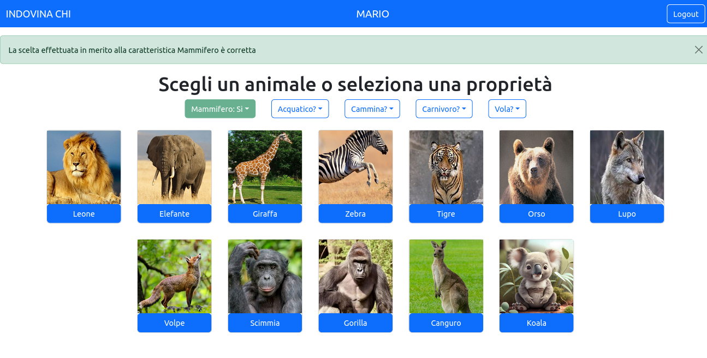

# Exam #3: "Indovina chi"
## Student: s303053 BERGADANO SIMONE 

## React Client Application Routes

- Route `/`: Menù principale in cui è possibile selezionare la difficoltà e avviare la partita o accedere allo storico delle partite effettuate se si è loggati
- Route `partita/:difficulty/:id`: Pagina in cui si gioca, la route contiene la difficoltà selezionata e un identificativo univoco della partita
- Route `/storico-partite`: Pagina in cui viene mostrato lo storico delle partite ci si può accedere solo se si è loggati.
- Route `/login`: Pagina in cui è possibile autenticarsi

## API Server

### API Autenticazione

  #### Get current authentication status

- GET `/api/sessions/current`
  - description: _GET_ verifica che ci sia un token di autenticazione nella sessione attiva
  - request parameters and request body content
  - response: 200 OK (success)
  - body content:
  <pre>
  {
    "authenticated_user_name"
  }
  </pre>
  - ERROR RESPONSE: 401 Unauthorized (user not authenticated)
  - ERROR RESPONSE BODY:
  <pre>
  {
      error: "Unauthenticated user!"
  }
  </pre>

#### Login

- POST /api/sessions
  - description: esegue l'autenticazione dell'utente tramite email e password fornite
  - ERROR RESPONSE: 401 Unauthorized (user not authenticated)
  - ERROR RESPONSE BODY:
  <pre>
  {
      error: wrong login messages...
  }
  </pre>

#### Logout

- DELETE /api/sessions/current
  - description: _DELETE_ dalla sessione corrente dell'utente autenticato; setta l'utente ad 'undefined'
  - request parameters: _None_
  - response: 200 OK (success)
  - body content: _None_

### API Indovina chi

- GET `/api/animals/:difficulty`
  restituisce la lista di oggetti "animale" (il numero di oggetti dipende dal parametro difficoltà), non è richiesta l'autenticazione.
  - request parameters: _difficulty_
  - response: 200 OK (success)
  - error response 500 (Server error)
  - error response 422 (Unprocessable content)
  - body content: _animals array_

- GET `/api/properties`
restituisce la lista delle proprietà assegnate agli animali, non è richiesta l'autenticazione.
  - request parameters: _None_
  - response: 200 OK (success)
  - body content: _property array_

- POST `/api/matches/new` Crea una nuova partita prende la difficoltà contenuta nel body scrive sul database informazioni quali identificativo partita, identificativo utente (-1 se la richiesta proviene da un utente non autenticato), oggetto misteroso e data. Il punteggio partita è inizialmente NULL, verrà scritto con un update al termine della partita. L'identificativo univoco della partita  è calcolato come numero progressivo partendo da 1.
  - request parameters: _difficulty_
  - response: 200 OK (success)
  - error response 500 (Server error)
  - error response 422 (Unprocessable content)
  - body content:
  {
    id: _match_id_
  }

- POST `/api/askQuestion/:match_id` fornisce l'informazione richiesta in merito alla proprietà dell'animale misterioso della partita con identificativo specificato, aumentando il conteggio delle richieste relativamente alla partita. Prima di agire verifica che la richiesta provenga dall'utente che ha creato la partita. Prima di agire verifica che la richiesta provenga dall'utente che ha creato la partita. (se la partita è stata creata da un utente autenticato) L'API può essere chiamata una sola volta per ciascun match id dal momento che termina la partita.
  - request parameters: _match_id_, _property_
  - response: 200 OK (success)
  - error response 500 (Server error)
  - error response 422 (Unprocessable content)
  - error response 401 (Unauthorized)

  - request body content:
  <pre>
  {
    property: property_name
  }
  </pre>
  
  - response body content:
  <pre>
  {
    property_name: property_value
  }
  </pre>

- POST `/api/guessAnimal/:match_id` Verifica che l'animale scelto sia quello misterioso, calcola il punteggio, lo scrive sul db e lo invia al client.
  - request parameters: _match_id_, _animal_
  - response: 200 OK (success)
  - error response 500 (Server error)
  - error response 422 (Unprocessable content)
  - error response 401 (Unauthorized)
  
  - request body content:
  <pre>
  {
    animal: client_animal
  }
  </pre>
  
  - response body content:
  <pre>
  {
    animal: secret_animal
    punteggio: valore_punteggio
  }
  </pre>

  L'animale segreto viene inviato al client solo al termine della partita quando il punteggio è stato già salvato.

- GET `/api/history/` Fornisce alcune informazioni sulle partite effettuate dell'utente loggato. Ci si può accedere solo se si è loggati.

  - request parameters: _match_id_, _animal_
  - response: 200 OK (success)
  - error response 500 (Server error)
  - error response 401 (Unauthorized)

Inoltre sono state impostate una serie di route statiche `/images/{nome_animale}.JPG` per permettere al client di scaricare le immagini degli animali da visualizzare.

## Database Tables

- Table `user` - contiene le informazioni relative agli utenti quali nome utente mail e password salvata come hash della password in chiaro più il sale.

- Table `Animali` - Contiene la lista dei 36 animali e i rispettivi valori delle proprietà

- Table `Last_id` - Contiene un unico valore: l'ultimo id utilizzato come identificativo di una partiva, viene incrementato ogni qual volta una nuova partita viene creata.

- Table `Partite` - Contiene informazioni di ogni partita la partita è terminata se il campo punteggio è diverso da NULL. L'identificativo della partita è chiave primaria.

## Main React Components

- `GameScreen` (in `GameScreen.jsx`): contiene tutti gli elementi della schermata di gioco inoltre gestisce il caricamento dei dati quali la lista di animali e proprietà e il termine della partita. Integra un animazione di caricamento.

- `Grid` (in `GameScreen.jsx`): Contiene le N card contenenti gli animali in una vista bidimensionale che si adatta dinamicamente.

- `Card` (in `GameScreen.jsx`): Contiene l'immagine dell'animale e un bottone per sceglierlo

- `Choices` (in `GameScreen.jsx`): contiene la lista dei menu con le proprietà da scegliere

- `Choice` (in `GameScreen.jsx`): Contiene il menù a tendina con la scelta della proprietà gestisce la richiesta al server di confermare la proprietà e integra una animazione di caricamento.

- `History` (in `History.jsx`): contiene tutti gli elementi dello dello pagina con lo storico delle partite dal server integra un animazione di caricamento per aspettare il caricamento dei dati.

- `HistoryTable` (in `History.jsx`): Tabella con motivo striped con all'interno le informazioni di ciascuna partita effettuata. 

(only _main_ components, minor ones may be skipped)

## Screenshot

## Users Credentials

- username: "Mario", mail: "mario@mail.com", password: "password"
- username: "Lucia", mail: "lucia@mail.com", password: "password"
- username: "Luigi", mail: "luigi@mail.com", password: "password"

